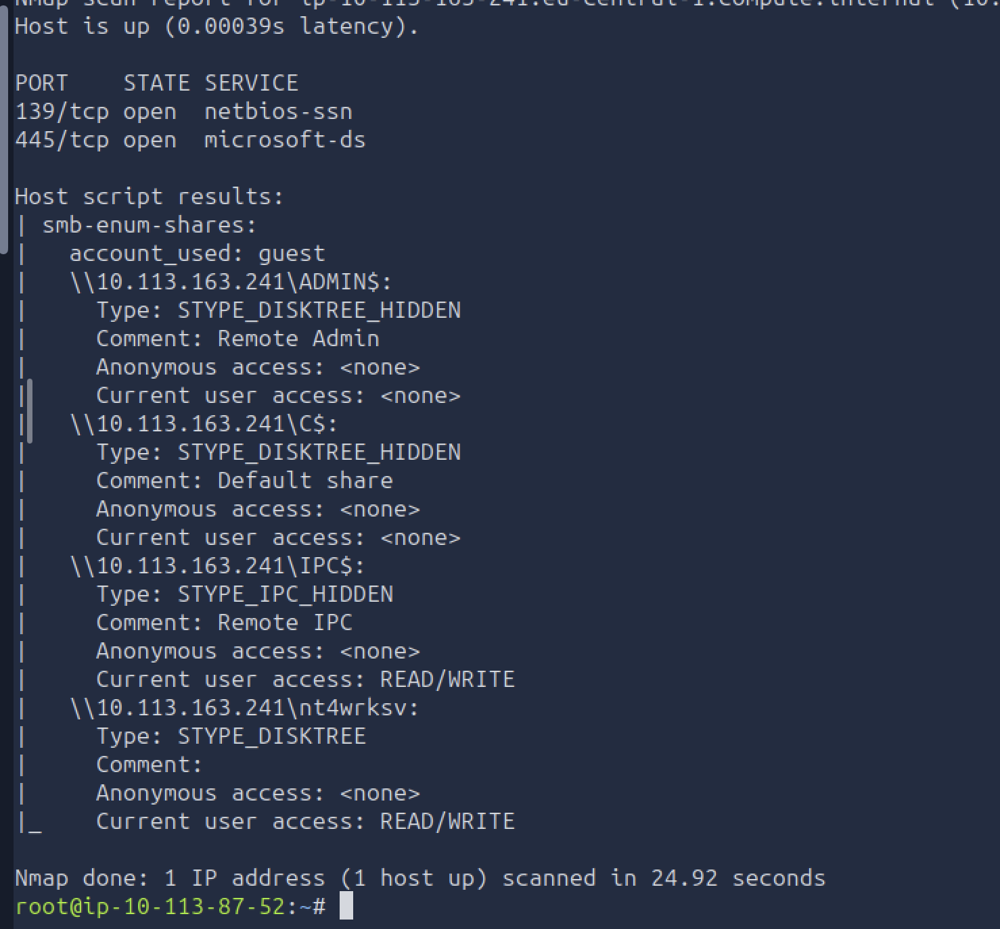
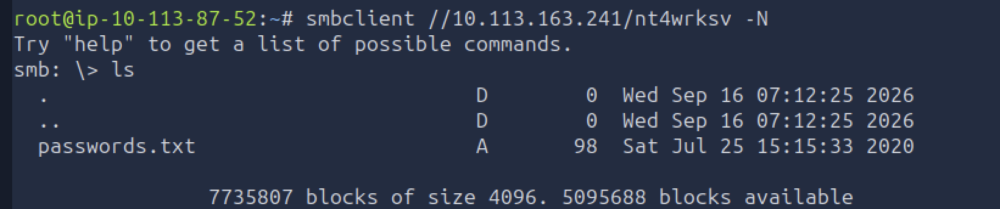
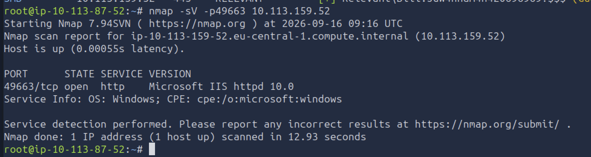
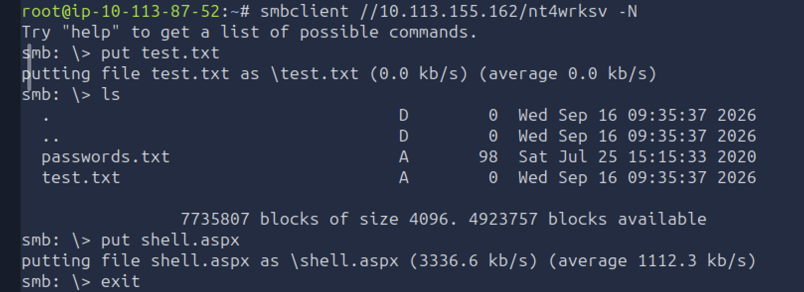
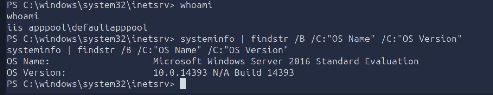
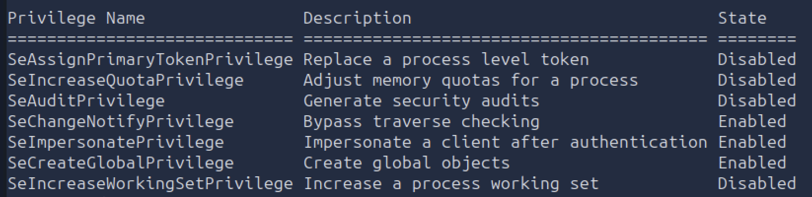
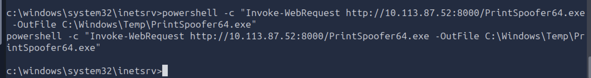

# Relevant - Penetration Test Report

## Executive Summary

A penetration test was conducted against the Relevant lab environment to identify security weaknesses that could allow unauthorized access or privilege escalation.

Initial reconnaissance identified several exposed services, including SMB, RDP, and multiple HTTP/RPC services. Enumeration of the SMB service revealed a writable share containing sensitive credential material. Further testing showed that the writable SMB share mapped to a directory served by Microsoft IIS on a separate HTTP port.

This configuration allowed an ASPX payload to be uploaded through SMB and subsequently executed through the IIS web server, resulting in remote command execution on the target host.

The initial shell was obtained under the `IIS APPPOOL\DefaultAppPool` identity. Local privilege enumeration revealed that the account possessed the `SeImpersonatePrivilege` privilege. This privilege was successfully abused using PrintSpoofer to obtain a shell running as `NT AUTHORITY\SYSTEM`.

The assessment therefore demonstrated a complete compromise path from unauthenticated network access to full administrative control of the Windows host.

---

## Scope and Methodology

The assessment was performed against a single Windows Server host within an authorized lab environment.

Testing included:

- Network service enumeration
- SMB share enumeration
- Inspection of exposed files and credentials
- Web service enumeration
- Testing for relationships between exposed services
- Remote code execution through a writable web-accessible directory
- Local privilege enumeration
- Windows token impersonation privilege escalation

The assessment followed a black-box methodology, beginning with no prior knowledge of the target configuration.

> **Note:** The target IP changed during the lab session due to machine redeployment. `TARGET_IP` is used throughout this report for consistency.

---

## Findings Summary

| ID | Finding | Severity |
|---|---|---|
| F-01 | Writable SMB Share Accessible Without Authentication | High |
| F-02 | Remote Code Execution via SMB-to-IIS File Mapping | Critical |
| F-03 | Privilege Escalation via `SeImpersonatePrivilege` | Critical |

---

## Attack Chain Overview

```text
Network Enumeration
        ↓
Writable SMB Share Identified
        ↓
SMB Share Mapped to IIS Web Directory
        ↓
ASPX Payload Uploaded
        ↓
Remote Shell as IIS APPPOOL\DefaultAppPool
        ↓
SeImpersonatePrivilege Identified
        ↓
PrintSpoofer Token Impersonation
        ↓
NT AUTHORITY\SYSTEM
```

---

## F-01: Writable SMB Share Accessible Without Authentication

**Severity:** High  
**Affected Service:** SMB (TCP 445)  
**Affected Share:** `nt4wrksv`

### Description

SMB enumeration identified a network share named `nt4wrksv` that could be accessed without valid credentials and provided read/write permissions.

Anonymous write access to a network share introduces significant risk because an unauthenticated attacker can place arbitrary files on the target system. The impact becomes more severe when the writable directory is used by another service or application.

In this case, the share was later found to map to a directory exposed by Microsoft IIS, allowing uploaded files to be executed through the web server.

### Evidence

SMB enumeration showed that the `nt4wrksv` share was accessible with read/write permissions.



Accessing the share directly also revealed a sensitive file named `passwords.txt`.



### Impact

An unauthenticated attacker could:

- Read files stored within the share
- Upload arbitrary files to the target
- Modify share contents
- Potentially interact with other services consuming files from the same directory

Because the share was mapped to an IIS-served directory, this write access ultimately contributed directly to remote code execution.

### Remediation

- Disable anonymous access to SMB shares
- Restrict share permissions to explicitly authorized users and groups
- Remove unnecessary write permissions
- Avoid mapping writable network shares directly into web application directories
- Review SMB share ACLs and NTFS permissions for excessive access
- Remove sensitive credential material from publicly accessible or weakly protected shares

---

## F-02: Remote Code Execution via SMB-to-IIS File Mapping

**Severity:** Critical  
**Affected Services:** SMB (TCP 445), Microsoft IIS (TCP 49663)

### Description

Further enumeration identified Microsoft IIS running on TCP port `49663`.

The writable `nt4wrksv` SMB share was found to map to a directory served by the IIS web server. This allowed files uploaded through SMB to become accessible over HTTP.

Because the IIS instance supported ASP.NET, an attacker could upload an `.aspx` payload into the SMB share and then request that file through the web server. The server executed the uploaded payload, resulting in remote command execution on the host.

### Evidence

Service enumeration confirmed that TCP port `49663` was running Microsoft IIS.



A test file and an ASPX payload were successfully uploaded to the writable SMB share.



The uploaded ASPX payload was then accessed through the IIS web endpoint:

```text
http://TARGET_IP:49663/nt4wrksv/shell.aspx
```

### Impact

This vulnerability allowed an unauthenticated remote attacker to achieve arbitrary code execution on the target host.

Successful exploitation provided a shell running under the IIS application pool identity:

```text
IIS APPPOOL\DefaultAppPool
```

### Remediation

- Remove write access from SMB shares that map to web-served directories
- Separate file-transfer and storage locations from executable web directories
- Restrict IIS application directories so untrusted users cannot upload or modify executable content
- Disable execution of unnecessary server-side file types
- Apply least-privilege permissions to SMB shares and underlying NTFS directories
- Review IIS virtual directory mappings for unintended exposure
- Monitor web directories for unexpected or newly created executable files
- Remove anonymous or guest write access wherever it is not explicitly required

---

## F-03: Privilege Escalation via `SeImpersonatePrivilege`

**Severity:** Critical  
**Affected Account:** `IIS APPPOOL\DefaultAppPool`  
**Affected Host:** Windows Server 2016

### Description

Following initial code execution through IIS, the compromised process was found to be running under the `IIS APPPOOL\DefaultAppPool` identity.

Privilege enumeration showed that this account possessed the `SeImpersonatePrivilege` privilege. This Windows privilege allows a process to impersonate security tokens associated with other users or services.

Because the IIS application pool identity retained this privilege, a token impersonation technique could be used to obtain a highly privileged token and spawn a process running as `NT AUTHORITY\SYSTEM`.

### Evidence

The initial shell was confirmed to be running under the IIS application pool identity, and the target operating system was identified as Windows Server 2016.



Privilege enumeration revealed that `SeImpersonatePrivilege` was enabled for the current process.



The PrintSpoofer utility was transferred to the target host for use in exploiting the impersonation privilege.



The privilege was successfully abused to obtain a shell running as:

```text
NT AUTHORITY\SYSTEM
```

### Impact

Successful exploitation resulted in complete administrative control of the target host.

SYSTEM-level access could allow an attacker to:

- Read, modify, or delete sensitive files
- Access credentials and configuration data
- Create or modify local user accounts
- Disable security controls
- Install persistence mechanisms
- Access data belonging to other users or services
- Use the host as a platform for further attacks

In this assessment, exploitation of SeImpersonatePrivilege converted the initial low-privileged IIS foothold into full operating-system compromise.

### Remediation

- Run IIS application pools with the minimum privileges required for their function
- Review whether application pool identities require impersonation privileges
- Avoid granting unnecessary token impersonation rights to service accounts
- Apply Microsoft security updates and hardening guidance relevant to Windows token impersonation abuse
- Restrict execution and upload of unauthorized binaries on application servers
- Use endpoint protection and application-control policies to prevent execution of known privilege-escalation tooling
- Regularly audit service accounts and application pool identities for excessive Windows privileges

---

## Conclusion

The assessment demonstrated a complete attack path from unauthenticated network access to full SYSTEM-level compromise of the Windows host.

The compromise was enabled by a combination of security weaknesses rather than a single isolated issue:

- A writable SMB share was accessible without valid authentication
- The writable share mapped to a directory served by Microsoft IIS
- ASP.NET execution allowed an uploaded `.aspx` payload to achieve remote code execution
- The resulting IIS application pool context possessed `SeImpersonatePrivilege`
- Token impersonation was successfully abused to obtain `NT AUTHORITY\SYSTEM`

The most significant risk came from the interaction between services. SMB write access alone was not sufficient for code execution, but because the same directory was exposed through IIS, the file-write capability became a remote-code-execution path.

This highlights the importance of reviewing not only individual service configurations, but also how different services interact with shared files and permissions.

---

## Lessons Learned

Several useful penetration-testing lessons came out of this assessment.

### Validate assumptions with control tests

A successful-looking response does not always prove that authentication or exploitation worked as expected. During SMB testing, invalid credentials still returned a share listing because access was falling back to guest.

Using deliberately incorrect credentials helped confirm that the apparent authentication success was misleading.

### Look for relationships between services

The key foothold came from recognizing that two exposed services interacted with the same underlying directory.

```text
Writable SMB Share
        +
IIS Web Directory
        ↓
Server-Side Payload Execution
```

> This assessment was performed in an authorized lab environment for educational purposes. Sensitive values have been redacted.